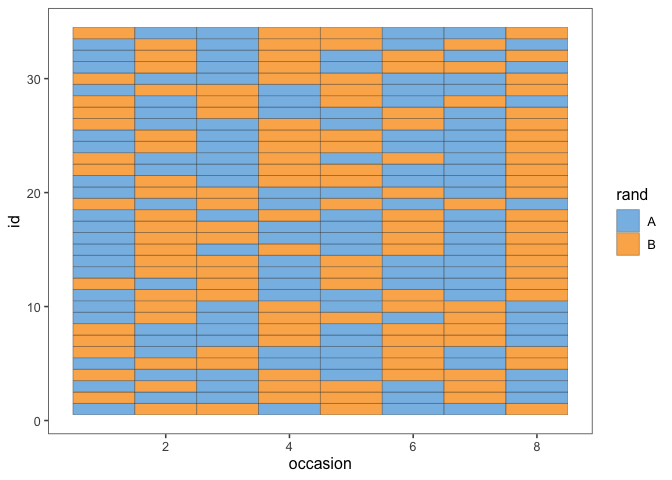
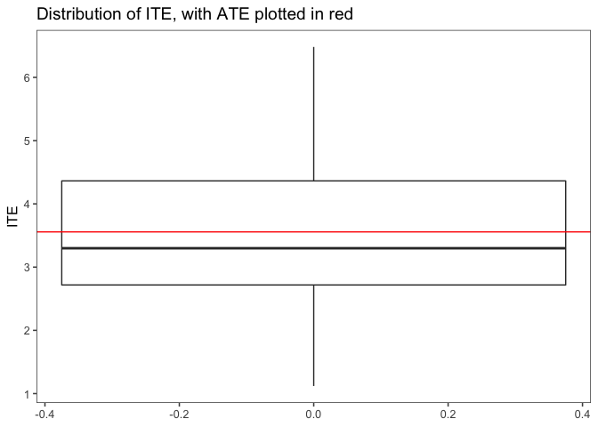

Simulation
================
Laura Cosgrove
11/27/2019

# Recreate Araujo et al. simulation

\(Y_{irs} = \lambda_i + \beta_{ir} + \epsilon_{irs} + Z_{irs}\tau_i\)

where \(Y_{irs}\) is the measured outcome for occasion s, $s = 1, 2 $ of
cycle r, \(r = 1, 2, .... k\) for patient i, \(i = 1, 2, n\), and:

  - \(\lambda_i \sim N(\Lambda, \phi^2)\): Patient-specific mean of the
    outcome, drawn from a normal distribution with population mean of
    \(\Lambda\)

  - \(\beta_{ir} \sim N(0, \gamma^2)\) : Within patient, within cycle
    (block) random noise

  - \(\epsilon_{irs} \sim N(0, \sigma^2)\) : Within patient, within
    cycle (block), within occassion (independent of treatment) random
    noise

  - \(\tau_{i} \sim N(T, \psi^2)\): Where \(Z_{irs}\) takes values
    \(\frac{1}{2}\) when the occassion \(s\) has treatment A and
    \(-\frac{1}{2}\) when occassion \(s\) has treatment B, the
    patient-specific for treatment effect, drawn from a normal
    population mean treatment effect of T. Therefore, an estimate for
    HTE (heterogeneity of treatment effect) is \(\psi^2\).

From our PREEMPT study setting:

“The sample size required for the proposed RCT is based on the primary
outcome: change from baseline to 26 weeks on the PROMIS pain
interference scale. Assuming that the minimally important difference is
0.4 SD difference (4 points) and that 10% of those who enter the study
will not complete an endpoint and will therefore be assigned a change of
0, the full sample (endpoint completers plus non-completers) would need
to show a 3.6-point difference in order for the completers to show a
minimally important difference. Assuming a common standard deviation of
10 points, each group (Trialist app and usual care) would need to
include 122 patients (244 in total) in order to have 80% power to detect
a 3.6-point difference in means using a 2-group t-test with a 0.05
2-sided significance level.”

Reference: PROMIS scores have a mean of 50 and standard deviation (SD)
of 10 in a clinically relevant referent population. Assume division by
10 in the PREEMPT case.

1.  Set parameter values

<!-- end list -->

``` r
#cycles, treatments, n
k = 4
s = 2
n = 34

#priors
##lambda_i
Lambda = 50
phi = 10

##beta_ir: choose sd that's lower than meaningful change (0.4)
gamma = 4

##epsilon_irs: choose same sd as within cycle change
sigma = 2

##tau: simulate T to be treatment effect under minimum importance
## simulate hte to be the variance if 1/4 of population had T
T = 4
psi = 1
```

2.  Set the block randomization schedule for patients

<!-- end list -->

``` r
library(blockrand)
library(tidyverse)
set.seed(12)

#functions
block_rand = function(n_cycles = k, n_tx = s, char_tx = c("A", "B")) {

blockrand(n = n_tx*n_cycles, num.levels = n_tx, levels = char_tx, block.sizes = 1) %>% 
    pull(treatment)
  
}


get_n_blockrands = function(n_pt = n, n_cycles = k, n_tx = s, char_tx = c("A", "B")) {

rand_df <- tibble(id = 1:n_pt) %>% 
  mutate(rand = map(id, ~block_rand(n_cycles, n_tx, char_tx)))

rand_df
}

#Example Demonstration
block_rand()
```

    ## [1] B A A B A B B A
    ## Levels: A B

``` r
rand_df <- get_n_blockrands()

rand_df %>% 
  unnest_longer(col = rand) %>% 
  group_by(id) %>% 
  mutate(occasion = 1:(s*k)) %>% 
  ggplot(aes(y = id, x = occasion, fill = rand)) +  
  geom_tile(color = "black") + ggthemes::scale_fill_few() + ggthemes::theme_few()
```

<!-- -->

``` r
seq_df <- rand_df %>% 
  unnest_longer(col = rand) %>% 
  group_by(id) %>% 
  mutate(cycle = rep(1:k, each = 2)) %>% 
  nest(-c("id", "cycle"), data = c(rand)) %>% 
  mutate(seq = map_chr(data, ~.x  %>% pull(rand) %>% stringr::str_flatten(., collapse = ", "))) %>% 
  select(-data) %>%
  mutate(seq = factor(seq)) 

seq_df %>% 
  group_by(cycle, seq) %>% count() %>% 
  ggplot(aes(x = seq, y = n)) +  geom_col(position = "dodge") + facet_grid(~cycle) + ggthemes::theme_few() + labs(title = "Distribution of cycle order in study", y = "Number of patients")
```

<!-- -->

As shown, the order `(B, A)` or `(A, B)` is relatively evenly
distributed among cycles.

3.  Choose a patient i and simulate a value \(\lambda_i\) and another
    value \(\tau_i\). These are to be retained and used until all values
    for that patient have been generated.

<!-- end list -->

``` r
set.seed(11)

rand_df <- rand_df %>% 
  mutate(lambda = map_dbl(id, ~rnorm(1, mean = Lambda, sd = phi))) %>% 
  mutate(tau = map_dbl(id, ~rnorm(1, T, psi)))
```

4.  Generate a value \(\beta_{ir}\) for cycle r of patient i. This is to
    be retained and used for both occasions of that cycle of that
    patient’s course of treatments

<!-- end list -->

``` r
set.seed(10)

rand_df <- rand_df %>% 
  unnest_longer(col = rand) %>% 
  group_by(id) %>% 
  mutate(cycle = rep(1:k, each = 2)) %>% 
  nest(data = c(rand)) %>% rename(rand = data) %>% 
  mutate(beta = map_dbl(id, ~rnorm(1, mean = 0, sd = gamma)))
```

5.  Generate a random number \(X_{ir}\) from U(0,1) for that cycle.

<!-- end list -->

``` r
set.seed(9)

rand_df <- rand_df %>% 
  mutate(X = map_dbl(id, ~rnorm(1, mean = 0, sd = 1)))
```

6.  Generate a value \(\epsilon_{irs}\) for occasion s of cycle r for
    patient i.

<!-- end list -->

``` r
set.seed(8)

rand_df <- rand_df %>%
  mutate(rand = map(rand, ~unlist(.x))) %>% 
  mutate(measure = list(c(1, 2))) %>% 
  unnest_longer(col = rand) %>% unnest_longer(col = measure) %>%  
  select(-rand_id) %>% 
  mutate(epsilon = map_dbl(rand, ~rnorm(1, mean = 0, sd = sigma)))
```

7.  Calculate the response as the sum of the value of \(\lambda_i\) for
    that patient \(\beta_ir\) for that cycle, \(\epsilon_{irs}\) for
    that occasion and the product of \(\tau_i\) for that patient
    multiplied by \(Z_irs\) for that occasion.

<!-- end list -->

``` r
rand_df <- rand_df %>% 
  mutate(Z = if_else(rand == "A", 1/2, -1/2)) %>% 
  mutate(Y = lambda + beta + epsilon + tau*Z) %>% 
  select(id, cycle, rand, Y, lambda, beta, epsilon, Z, tau)

rand_df
```

    ## # A tibble: 544 x 9
    ## # Groups:   id [34]
    ##       id cycle rand      Y lambda    beta epsilon     Z   tau
    ##    <int> <int> <fct> <dbl>  <dbl>   <dbl>   <dbl> <dbl> <dbl>
    ##  1     1     1 A      45.6   44.1  0.0750  -0.169   0.5  3.13
    ##  2     1     1 A      47.4   44.1  0.0750   1.68    0.5  3.13
    ##  3     1     1 B      41.7   44.1  0.0750  -0.927  -0.5  3.13
    ##  4     1     1 B      41.5   44.1  0.0750  -1.10   -0.5  3.13
    ##  5     1     2 B      43.3   44.1 -0.737    1.47   -0.5  3.13
    ##  6     1     2 B      41.6   44.1 -0.737   -0.216  -0.5  3.13
    ##  7     1     2 A      44.6   44.1 -0.737   -0.341   0.5  3.13
    ##  8     1     2 A      42.7   44.1 -0.737   -2.18    0.5  3.13
    ##  9     1     3 B      31.0   44.1 -5.49    -6.02   -0.5  3.13
    ## 10     1     3 B      35.9   44.1 -5.49    -1.19   -0.5  3.13
    ## # … with 534 more rows

\`

``` r
rand_df %>% 
  group_by(id, rand) %>% 
  summarize(Y_bar = mean(Y)) %>% 
  ungroup() %>% 
  pivot_wider(names_from = rand, values_from = Y_bar) %>% 
  group_by(id) %>% 
  summarize(ITE = A - B) %>% 
  mutate(ATE = mean(ITE))  %>% 
  ggplot(aes(y = ITE)) + geom_boxplot() + geom_hline(aes(yintercept = ATE, slope = 0), color = "red") + ggthemes::theme_few() + labs(title = "Distribution of ITE, with ATE plotted in red")
```

    ## Warning: Ignoring unknown aesthetics: slope

<!-- -->

``` r
rand_df %>% 
  group_by(id, rand) %>% 
  summarize(Y_bar = mean(Y)) %>% 
  ungroup() %>% 
  pivot_wider(names_from = rand, values_from = Y_bar) %>% 
  group_by(id) %>% 
  summarize(ITE = A - B) %>% 
  summarize(ATE = mean(ITE),
    sd_ATE = sd(ITE))  
```

    ## # A tibble: 1 x 2
    ##     ATE sd_ATE
    ##   <dbl>  <dbl>
    ## 1  3.56   1.36

122 subjects x 4 cycles seems clearly enough to detect the true ATE
under the chosen conditions. Now, let’s examine the operating
characteristics more formally based on our analysis plan (a mixed
effects model).

# Analyze series of n of 1 trials

\[Y_{irs} = \lambda_i + \beta_{ir} + \epsilon_{irs} + Z_{irs}\tau_i\]
Set up functions to create the datasets:

``` r
set.seed(1)
library(lme4)
analysis_df <- rand_df %>% 
  select(id, rand, cycle, Z, Y) %>% 
  ungroup()


mod = lme4::lmer(Y ~ 1 + Z + (1|id:cycle) + (Z|id) , data = analysis_df)
```

    ## Warning in checkConv(attr(opt, "derivs"), opt$par, ctrl =
    ## control$checkConv, : Model failed to converge with max|grad| = 0.0604923
    ## (tol = 0.002, component 1)

``` r
summary(mod)
```

    ## Linear mixed model fit by REML ['lmerMod']
    ## Formula: Y ~ 1 + Z + (1 | id:cycle) + (Z | id)
    ##    Data: analysis_df
    ## 
    ## REML criterion at convergence: 2806
    ## 
    ## Scaled residuals: 
    ##      Min       1Q   Median       3Q      Max 
    ## -2.61546 -0.52893  0.01689  0.58352  2.36501 
    ## 
    ## Random effects:
    ##  Groups   Name        Variance Std.Dev. Corr
    ##  id:cycle (Intercept) 12.026   3.4678       
    ##  id       (Intercept) 57.804   7.6029       
    ##           Z            0.738   0.8591   0.00
    ##  Residual              4.460   2.1119       
    ## Number of obs: 544, groups:  id:cycle, 136; id, 34
    ## 
    ## Fixed effects:
    ##             Estimate Std. Error t value
    ## (Intercept)  45.6485     1.3404   34.05
    ## Z             3.5568     0.2335   15.23
    ## 
    ## Correlation of Fixed Effects:
    ##   (Intr)
    ## Z 0.000 
    ## convergence code: 0
    ## Model failed to converge with max|grad| = 0.0604923 (tol = 0.002, component 1)

Here, we can see that our parameter values are recovered to a large
degree.

  - We set \(\phi\) in \(\lambda_i \sim N(\Lambda, \phi^2)\), the
    standard deviation of the patient-specific mean of the outcome,
    drawn from a normal distribution with population mean of
    \(\Lambda\), to be 10. Here, the corresponding estimate in the
    variance of the outcome is under random effects of `id`, where it is
    7.57.

  - We set \(\Lambda\) in \(\lambda_i \sim N(\Lambda, \phi^2)\), to be
    50. Here, the corresponding estimate in the mean of the outcome is
    under fixed effects, where it estimated as 45.65.

  - We set \(\gamma\) in \(\beta_{ir} \sim N(0, \gamma^2)\), the within
    patient, within cycle (block) random noise, to be 4. Here, the
    corresponding estimate in the mean of the outcome is under random
    effects, `id:cycle` where it estimated as 3.47.

  - We set \(\sigma\) in \(\epsilon_{irs} \sim N(0, \sigma^2)\), the
    within patient, within cycle (block), within occassion (independent
    of treatment) random noise to be 2: here, it is the residual random
    effects variance, where it is estimated to be 2.11.

  - We set T in \(\tau_{i} \sim N(T, \psi^2)\), the population average
    treatment effect, to be 4. Here, it is estimated under the fixed
    effects Z term, as 3.79.

  - We set \(\psi\) in \(\tau_{i} \sim N(T, \psi^2)\), the heterogeneity
    of treatment effect, to be 1. Here, it is estimated under the random
    effects slope term of Z by treatment, as 7.96.

# Operating characteristics

For the above simulation, the confidence interval of T contains 4, and
this will be the determination of treatment effect recovery for the
operating characteristics:

``` r
broom::tidy(mod, "fixed", conf.int = TRUE)
```

    ## # A tibble: 2 x 6
    ##   term        estimate std.error statistic conf.low conf.high
    ##   <chr>          <dbl>     <dbl>     <dbl>    <dbl>     <dbl>
    ## 1 (Intercept)    45.6      1.34       34.1    43.0      48.3 
    ## 2 Z               3.56     0.233      15.2     3.10      4.01

For the secondary outcome of estimating heterogeneity of treatment
effects correctly, we will consider an interval of 0.2, 1.8 – 2
minimally-important standard deviations from the true heterogeneity of
treatment effect – to be acceptable for the operating characteristics.

## Functions

``` r
#function to block randomize
get_n_blockrands(n_pt = n, n_cycles = k, n_tx = s, char_tx = c("A", "B"))
```

    ## # A tibble: 34 x 2
    ##       id rand     
    ##    <int> <list>   
    ##  1     1 <fct [8]>
    ##  2     2 <fct [8]>
    ##  3     3 <fct [8]>
    ##  4     4 <fct [8]>
    ##  5     5 <fct [8]>
    ##  6     6 <fct [8]>
    ##  7     7 <fct [8]>
    ##  8     8 <fct [8]>
    ##  9     9 <fct [8]>
    ## 10    10 <fct [8]>
    ## # … with 24 more rows

``` r
#function to create lambda and tau
get_pt_level_effects = function(dat, pop_mean_Y = Lambda, pop_sd_Y = phi, pop_ave_TE = T, pop_sd_TE = psi ) {
  dat %>% 
  mutate(lambda = map_dbl(id, ~rnorm(1, mean = pop_mean_Y, sd = pop_sd_Y))) %>% 
  mutate(tau = map_dbl(id, ~rnorm(1, pop_ave_TE, pop_sd_TE)))
}

get_cycle_level_effects = function(dat, n_cycles = k, sd_Y_cycles = gamma) {
dat %>% 
  unnest_longer(col = rand) %>% 
  group_by(id) %>% 
  mutate(cycle = rep(1:n_cycles, each = 2)) %>% 
  nest(data = c(rand)) %>% rename(rand = data) %>% 
  mutate(beta = map_dbl(id, ~rnorm(1, mean = 0, sd = sd_Y_cycles)))
}

get_occasion_level_effects = function(dat, measurements = 2, sd_Y_occassion = sigma) {
dat %>%
  mutate(rand = map(rand, ~unlist(.x))) %>% 
  mutate(measure = list(1:measurements)) %>% 
  unnest_longer(col = rand) %>% unnest_longer(col = measure) %>%  
  select(-rand_id) %>% 
  mutate(epsilon = map_dbl(rand, ~rnorm(1, mean = 0, sd = sd_Y_occassion)))
}

get_tx_ind = function(dat, measurements = 2, char_tx = c("A", "B")) {
  dat %>% 
  mutate(Z = if_else(rand == char_tx[[1]], 1/2, -1/2)) 
}

get_outcome = function(dat) {
  dat %>% 
  mutate(Y = lambda + beta + epsilon + tau*Z) %>% 
  select(id, cycle, rand, Y, lambda, beta, epsilon, Z, tau)
}
```

``` r
set.seed(11)
nsim = 100
sim_df <- tibble(sim = 1:nsim) %>% 
  mutate(data = map(sim, ~get_n_blockrands()))

sim_df <- sim_df %>% 
  mutate(data = map(data, ~get_pt_level_effects(dat = .x))) %>% 
  mutate(data = map(data, ~get_cycle_level_effects(dat = .x))) %>% 
  mutate(data = map(data, ~get_occasion_level_effects(dat = .x))) %>% 
  mutate(data = map(data, ~get_tx_ind(dat = .x))) %>% 
  mutate(data = map(data, ~get_outcome(dat = .x)))
```

## Model fitting for OC

``` r
set.seed(12)

fit_mod <- function(dat) {
  lme4::lmer(Y ~ 1 + Z + (1|id:cycle) + (Z|id) , data = dat)
}

sim_mod <- sim_df %>% 
  mutate(mod = map(data, ~fit_mod(.x))) 

sim_mod <- sim_mod %>% 
  mutate(T_est = map_dbl(mod, ~broom::tidy(.x, "fixed", conf.int = TRUE) %>% filter(term == "Z") %>% pull(estimate))) %>% 
  mutate(T_clow = map_dbl(mod, ~broom::tidy(.x, "fixed", conf.int = TRUE) %>% filter(term == "Z") %>% pull(conf.low))) %>% 
  mutate(T_chigh = map_dbl(mod, ~broom::tidy(.x, "fixed", conf.int = TRUE) %>% filter(term == "Z") %>% pull(conf.high))) %>%
  mutate(hte_est = map_dbl(mod, ~broom::tidy(.x) %>% filter(term == "sd_Z.id") %>% pull(estimate))) %>% 
  mutate(T_in_T_CI = if_else(T_clow <= T & T_chigh >= T, 1, 0)) %>% 
  mutate(rej_sharp_null = if_else(T_clow <= 0 & T_chigh >= 0, FALSE, TRUE)) %>% 
  mutate(wrong_selection = if_else(T < 0 & T_chigh > 0 | T > 0 & T_chigh < 0, TRUE, FALSE)) %>% 
  mutate(hte_mse = sqrt((hte_est - psi)^2) ) %>% 
  mutate(ate_mse =  sqrt((T_est - T)^2) )

sim_mod %>% 
  count(rej_sharp_null)
```

    ## # A tibble: 1 x 2
    ##   rej_sharp_null     n
    ##   <lgl>          <int>
    ## 1 TRUE             100

``` r
sim_mod %>% 
  count(wrong_selection)
```

    ## # A tibble: 1 x 2
    ##   wrong_selection     n
    ##   <lgl>           <int>
    ## 1 FALSE             100

``` r
sim_mod %>% 
  count(T_in_T_CI)
```

    ## # A tibble: 2 x 2
    ##   T_in_T_CI     n
    ##       <dbl> <int>
    ## 1         0     6
    ## 2         1    94

``` r
sim_mod %>% 
  ggplot(aes(x = hte_est)) + geom_density()+ geom_point(aes(y = 0, x = hte_est, alpha = rej_sharp_null)) + 
  ggthemes::theme_few()
```

    ## Warning: Using alpha for a discrete variable is not advised.

<!-- -->

``` r
##final table
summary_mod = sim_mod %>% 
  summarize(Power_SharpNull = mean(rej_sharp_null),
            PIS =  mean(wrong_selection),
            Power_Estimate = mean(T_in_T_CI),
            MSE_ATE = mean(ate_mse),
            MSE_HTE = mean(hte_mse)) %>% 
  mutate(Method = "Mixed Effects Model") %>% 
  dplyr::select(Method, everything())
```

## Matched paired t test

``` r
get_pair_test = function(dat){
D <- dat %>% 
  select(id, cycle, rand, Y) %>% 
  pivot_wider(names_from = rand, values_from = Y, values_fn = list(Y = mean)) 

t.test(D$A, D$B, paired = TRUE)
} 
test = get_pair_test(sim_df$data[[1]])

sim_tt <- sim_df %>% 
  mutate(ttest = map(data, ~get_pair_test(.x))) %>% 
  mutate(T_est = map_dbl(ttest, ~.x$estimate),
         T_clow = map_dbl(ttest, ~.x$conf.int[1]),
         T_chigh = map_dbl(ttest, ~.x$conf.int[2]),
         rej_sharp_null = map_dbl(ttest, ~.x$p.value),
         wrong_selection = if_else(rej_sharp_null < 0.05 & T_est < 0, TRUE, FALSE),
         rej_sharp_null = if_else(rej_sharp_null < 0.05, TRUE, FALSE),
         T_in_T_CI = if_else(T_clow <= T & T_chigh >= T, TRUE, FALSE),
         ate_mse = sqrt((T_est - T)^2))

summary_tt = sim_tt %>% 
  summarize(Power_SharpNull = mean(rej_sharp_null),
            PIS = mean(wrong_selection),
            Power_Estimate = mean(T_in_T_CI),
            MSE_ATE = mean(ate_mse, na.rm = TRUE),
            MSE_HTE = NA) %>% 
  mutate(Method = "Matched Pair T Test") %>% 
  dplyr::select(Method, everything())
```

## Metafor

The summary measures approach calculates the mean difference in outcome
under B minus the mean difference in outcome under A per patient. In the
literature this has been referred to as the basic estimator approach.
After getting these summary measures, metaanalysis can be performed.

``` r
library(metafor)
```

    ## Loading 'metafor' package (version 2.1-0). For an overview 
    ## and introduction to the package please type: help(metafor).

``` r
get_summary_measure <- function(dat) {
  dat %>% 
  select(id, cycle, rand, Y) %>% 
  group_by(id, cycle) %>% 
  pivot_wider(names_from = rand, values_from = Y, names_prefix = "t_", values_fn = list(Y  = mean)) %>% 
  summarize(d = t_A - t_B) %>% 
  summarize(d_mean = mean(d),
            d_var = var(d))
}

sim_df$data[[1]] %>% 
  select(id, cycle, rand, Y) %>% 
  group_by(id, cycle) %>% 
  pivot_wider(names_from = rand, values_from = Y, names_prefix = "t_", values_fn = list(Y  = mean)) %>%
  summarize(d = t_A - t_B) %>% 
  summarize(d_mean = mean(d),
            d_var = var(d))
```

    ## # A tibble: 34 x 3
    ##       id d_mean d_var
    ##    <int>  <dbl> <dbl>
    ##  1     1   4.86  2.85
    ##  2     2   4.30  1.09
    ##  3     3   4.06  2.08
    ##  4     4   2.59  2.25
    ##  5     5   3.69  7.84
    ##  6     6   3.63  1.45
    ##  7     7   5.71  1.83
    ##  8     8   5.56  1.47
    ##  9     9   3.67  1.40
    ## 10    10   4.42  3.12
    ## # … with 24 more rows

``` r
data <- get_summary_measure(sim_df$data[[1]])

fit_meta_mod <- function(dat) {
  try_fit = try(metafor::rma.uni(dat$d_mean, dat$d_var, method = "REML"))
  class = class(try_fit)
  if(class == "try-error") {
    list(beta = NA,
                  ci.lb = NA,
                  ci.ub = NA, 
                  tau2 = NA) 
  }
    else {
      try_fit
  }
}
sim_ma <- sim_df %>% 
    mutate(sum_data = map(data, ~get_summary_measure(.x))) %>% 
    mutate(rma = map(sum_data, ~fit_meta_mod(.x))) %>% 
  mutate(T_est = map_dbl(rma, ~.x$beta)) %>% 
  mutate(T_clow = map_dbl(rma, ~.x$ci.lb)) %>% 
  mutate(T_chigh = map_dbl(rma, ~.x$ci.ub)) %>%
  mutate(hte_est = map_dbl(rma, ~sqrt(.x$tau2))) %>% 
  mutate(T_in_T_CI = if_else(T_clow <= T & T_chigh >= T, 1, 0)) %>% 
  mutate(rej_sharp_null = if_else(T_clow <= 0 & T_chigh >= 0, FALSE, TRUE)) %>% 
  mutate(wrong_selection = if_else(T < 0 & T_chigh > 0 | T > 0 & T_chigh < 0, TRUE, FALSE)) %>% 
  mutate(hte_mse = sqrt((hte_est - psi)^2) ) %>% 
  mutate(ate_mse =  sqrt((T_est - T)^2))
```

    ## Warning in if (class == "try-error") {: the condition has length > 1 and
    ## only the first element will be used
    
    ## Warning in if (class == "try-error") {: the condition has length > 1 and
    ## only the first element will be used
    
    ## Warning in if (class == "try-error") {: the condition has length > 1 and
    ## only the first element will be used
    
    ## Warning in if (class == "try-error") {: the condition has length > 1 and
    ## only the first element will be used
    
    ## Warning in if (class == "try-error") {: the condition has length > 1 and
    ## only the first element will be used
    
    ## Warning in if (class == "try-error") {: the condition has length > 1 and
    ## only the first element will be used
    
    ## Warning in if (class == "try-error") {: the condition has length > 1 and
    ## only the first element will be used
    
    ## Warning in if (class == "try-error") {: the condition has length > 1 and
    ## only the first element will be used
    
    ## Warning in if (class == "try-error") {: the condition has length > 1 and
    ## only the first element will be used
    
    ## Warning in if (class == "try-error") {: the condition has length > 1 and
    ## only the first element will be used
    
    ## Warning in if (class == "try-error") {: the condition has length > 1 and
    ## only the first element will be used
    
    ## Warning in if (class == "try-error") {: the condition has length > 1 and
    ## only the first element will be used
    
    ## Warning in if (class == "try-error") {: the condition has length > 1 and
    ## only the first element will be used
    
    ## Warning in if (class == "try-error") {: the condition has length > 1 and
    ## only the first element will be used
    
    ## Warning in if (class == "try-error") {: the condition has length > 1 and
    ## only the first element will be used
    
    ## Warning in if (class == "try-error") {: the condition has length > 1 and
    ## only the first element will be used
    
    ## Warning in if (class == "try-error") {: the condition has length > 1 and
    ## only the first element will be used

    ## Error in metafor::rma.uni(dat$d_mean, dat$d_var, method = "REML") : 
    ##   Fisher scoring algorithm did not converge. See 'help(rma)' for possible remedies.
    ## Error in metafor::rma.uni(dat$d_mean, dat$d_var, method = "REML") : 
    ##   Fisher scoring algorithm did not converge. See 'help(rma)' for possible remedies.
    ## Error in metafor::rma.uni(dat$d_mean, dat$d_var, method = "REML") : 
    ##   Fisher scoring algorithm did not converge. See 'help(rma)' for possible remedies.
    ## Error in metafor::rma.uni(dat$d_mean, dat$d_var, method = "REML") : 
    ##   Fisher scoring algorithm did not converge. See 'help(rma)' for possible remedies.
    ## Error in metafor::rma.uni(dat$d_mean, dat$d_var, method = "REML") : 
    ##   Fisher scoring algorithm did not converge. See 'help(rma)' for possible remedies.

    ## Warning in if (class == "try-error") {: the condition has length > 1 and
    ## only the first element will be used
    
    ## Warning in if (class == "try-error") {: the condition has length > 1 and
    ## only the first element will be used
    
    ## Warning in if (class == "try-error") {: the condition has length > 1 and
    ## only the first element will be used
    
    ## Warning in if (class == "try-error") {: the condition has length > 1 and
    ## only the first element will be used
    
    ## Warning in if (class == "try-error") {: the condition has length > 1 and
    ## only the first element will be used
    
    ## Warning in if (class == "try-error") {: the condition has length > 1 and
    ## only the first element will be used
    
    ## Warning in if (class == "try-error") {: the condition has length > 1 and
    ## only the first element will be used
    
    ## Warning in if (class == "try-error") {: the condition has length > 1 and
    ## only the first element will be used
    
    ## Warning in if (class == "try-error") {: the condition has length > 1 and
    ## only the first element will be used

    ## Error in metafor::rma.uni(dat$d_mean, dat$d_var, method = "REML") : 
    ##   Fisher scoring algorithm did not converge. See 'help(rma)' for possible remedies.
    ## Error in metafor::rma.uni(dat$d_mean, dat$d_var, method = "REML") : 
    ##   Fisher scoring algorithm did not converge. See 'help(rma)' for possible remedies.

    ## Warning in if (class == "try-error") {: the condition has length > 1 and
    ## only the first element will be used

    ## Error in metafor::rma.uni(dat$d_mean, dat$d_var, method = "REML") : 
    ##   Fisher scoring algorithm did not converge. See 'help(rma)' for possible remedies.
    ## Error in metafor::rma.uni(dat$d_mean, dat$d_var, method = "REML") : 
    ##   Fisher scoring algorithm did not converge. See 'help(rma)' for possible remedies.

    ## Warning in if (class == "try-error") {: the condition has length > 1 and
    ## only the first element will be used

    ## Error in metafor::rma.uni(dat$d_mean, dat$d_var, method = "REML") : 
    ##   Fisher scoring algorithm did not converge. See 'help(rma)' for possible remedies.

    ## Warning in if (class == "try-error") {: the condition has length > 1 and
    ## only the first element will be used
    
    ## Warning in if (class == "try-error") {: the condition has length > 1 and
    ## only the first element will be used
    
    ## Warning in if (class == "try-error") {: the condition has length > 1 and
    ## only the first element will be used
    
    ## Warning in if (class == "try-error") {: the condition has length > 1 and
    ## only the first element will be used
    
    ## Warning in if (class == "try-error") {: the condition has length > 1 and
    ## only the first element will be used
    
    ## Warning in if (class == "try-error") {: the condition has length > 1 and
    ## only the first element will be used
    
    ## Warning in if (class == "try-error") {: the condition has length > 1 and
    ## only the first element will be used
    
    ## Warning in if (class == "try-error") {: the condition has length > 1 and
    ## only the first element will be used
    
    ## Warning in if (class == "try-error") {: the condition has length > 1 and
    ## only the first element will be used
    
    ## Warning in if (class == "try-error") {: the condition has length > 1 and
    ## only the first element will be used
    
    ## Warning in if (class == "try-error") {: the condition has length > 1 and
    ## only the first element will be used
    
    ## Warning in if (class == "try-error") {: the condition has length > 1 and
    ## only the first element will be used

    ## Error in metafor::rma.uni(dat$d_mean, dat$d_var, method = "REML") : 
    ##   Fisher scoring algorithm did not converge. See 'help(rma)' for possible remedies.
    ## Error in metafor::rma.uni(dat$d_mean, dat$d_var, method = "REML") : 
    ##   Fisher scoring algorithm did not converge. See 'help(rma)' for possible remedies.
    ## Error in metafor::rma.uni(dat$d_mean, dat$d_var, method = "REML") : 
    ##   Fisher scoring algorithm did not converge. See 'help(rma)' for possible remedies.
    ## Error in metafor::rma.uni(dat$d_mean, dat$d_var, method = "REML") : 
    ##   Fisher scoring algorithm did not converge. See 'help(rma)' for possible remedies.

    ## Warning in if (class == "try-error") {: the condition has length > 1 and
    ## only the first element will be used
    
    ## Warning in if (class == "try-error") {: the condition has length > 1 and
    ## only the first element will be used
    
    ## Warning in if (class == "try-error") {: the condition has length > 1 and
    ## only the first element will be used
    
    ## Warning in if (class == "try-error") {: the condition has length > 1 and
    ## only the first element will be used
    
    ## Warning in if (class == "try-error") {: the condition has length > 1 and
    ## only the first element will be used
    
    ## Warning in if (class == "try-error") {: the condition has length > 1 and
    ## only the first element will be used
    
    ## Warning in if (class == "try-error") {: the condition has length > 1 and
    ## only the first element will be used
    
    ## Warning in if (class == "try-error") {: the condition has length > 1 and
    ## only the first element will be used
    
    ## Warning in if (class == "try-error") {: the condition has length > 1 and
    ## only the first element will be used
    
    ## Warning in if (class == "try-error") {: the condition has length > 1 and
    ## only the first element will be used

    ## Error in metafor::rma.uni(dat$d_mean, dat$d_var, method = "REML") : 
    ##   Fisher scoring algorithm did not converge. See 'help(rma)' for possible remedies.
    ## Error in metafor::rma.uni(dat$d_mean, dat$d_var, method = "REML") : 
    ##   Fisher scoring algorithm did not converge. See 'help(rma)' for possible remedies.

    ## Warning in if (class == "try-error") {: the condition has length > 1 and
    ## only the first element will be used
    
    ## Warning in if (class == "try-error") {: the condition has length > 1 and
    ## only the first element will be used
    
    ## Warning in if (class == "try-error") {: the condition has length > 1 and
    ## only the first element will be used
    
    ## Warning in if (class == "try-error") {: the condition has length > 1 and
    ## only the first element will be used
    
    ## Warning in if (class == "try-error") {: the condition has length > 1 and
    ## only the first element will be used
    
    ## Warning in if (class == "try-error") {: the condition has length > 1 and
    ## only the first element will be used
    
    ## Warning in if (class == "try-error") {: the condition has length > 1 and
    ## only the first element will be used
    
    ## Warning in if (class == "try-error") {: the condition has length > 1 and
    ## only the first element will be used
    
    ## Warning in if (class == "try-error") {: the condition has length > 1 and
    ## only the first element will be used
    
    ## Warning in if (class == "try-error") {: the condition has length > 1 and
    ## only the first element will be used
    
    ## Warning in if (class == "try-error") {: the condition has length > 1 and
    ## only the first element will be used

    ## Error in metafor::rma.uni(dat$d_mean, dat$d_var, method = "REML") : 
    ##   Fisher scoring algorithm did not converge. See 'help(rma)' for possible remedies.

    ## Warning in if (class == "try-error") {: the condition has length > 1 and
    ## only the first element will be used
    
    ## Warning in if (class == "try-error") {: the condition has length > 1 and
    ## only the first element will be used
    
    ## Warning in if (class == "try-error") {: the condition has length > 1 and
    ## only the first element will be used
    
    ## Warning in if (class == "try-error") {: the condition has length > 1 and
    ## only the first element will be used
    
    ## Warning in if (class == "try-error") {: the condition has length > 1 and
    ## only the first element will be used
    
    ## Warning in if (class == "try-error") {: the condition has length > 1 and
    ## only the first element will be used

    ## Error in metafor::rma.uni(dat$d_mean, dat$d_var, method = "REML") : 
    ##   Fisher scoring algorithm did not converge. See 'help(rma)' for possible remedies.

    ## Warning in if (class == "try-error") {: the condition has length > 1 and
    ## only the first element will be used
    
    ## Warning in if (class == "try-error") {: the condition has length > 1 and
    ## only the first element will be used
    
    ## Warning in if (class == "try-error") {: the condition has length > 1 and
    ## only the first element will be used
    
    ## Warning in if (class == "try-error") {: the condition has length > 1 and
    ## only the first element will be used
    
    ## Warning in if (class == "try-error") {: the condition has length > 1 and
    ## only the first element will be used
    
    ## Warning in if (class == "try-error") {: the condition has length > 1 and
    ## only the first element will be used
    
    ## Warning in if (class == "try-error") {: the condition has length > 1 and
    ## only the first element will be used
    
    ## Warning in if (class == "try-error") {: the condition has length > 1 and
    ## only the first element will be used
    
    ## Warning in if (class == "try-error") {: the condition has length > 1 and
    ## only the first element will be used
    
    ## Warning in if (class == "try-error") {: the condition has length > 1 and
    ## only the first element will be used
    
    ## Warning in if (class == "try-error") {: the condition has length > 1 and
    ## only the first element will be used
    
    ## Warning in if (class == "try-error") {: the condition has length > 1 and
    ## only the first element will be used
    
    ## Warning in if (class == "try-error") {: the condition has length > 1 and
    ## only the first element will be used

    ## Error in metafor::rma.uni(dat$d_mean, dat$d_var, method = "REML") : 
    ##   Fisher scoring algorithm did not converge. See 'help(rma)' for possible remedies.

    ## Warning in if (class == "try-error") {: the condition has length > 1 and
    ## only the first element will be used

``` r
summary_ma = sim_ma %>% 
  summarize(Power_SharpNull = mean(rej_sharp_null, na.rm = TRUE),
            PIS = mean(wrong_selection, na.rm = TRUE),
            Power_Estimate = mean(T_in_T_CI, na.rm = TRUE),
            MSE_ATE = mean(ate_mse, na.rm = TRUE),
            MSE_HTE = mean(hte_mse, na.rm = TRUE)) %>% 
  mutate(Method = "Random Effects Meta-analysis") %>% 
  dplyr::select(Method, everything())
```

``` r
fit_fmeta_mod <- function(dat) {
  metafor::rma.uni(dat$d_mean, dat$d_var, method = "FE")
}


sim_fma <- sim_df %>% 
    mutate(sum_data = map(data, ~get_summary_measure(.x))) %>% 
    mutate(frma = map(sum_data, ~fit_fmeta_mod(.x))) %>% 
  mutate(T_est = map_dbl(frma, ~.x$beta)) %>% 
  mutate(T_clow = map_dbl(frma, ~.x$ci.lb)) %>% 
  mutate(T_chigh = map_dbl(frma, ~.x$ci.ub)) %>%
  mutate(T_in_T_CI = if_else(T_clow <= T & T_chigh >= T, 1, 0)) %>% 
  mutate(rej_sharp_null = if_else(T_clow <= 0 & T_chigh >= 0, FALSE, TRUE)) %>% 
  mutate(wrong_selection = if_else(T < 0 & T_chigh > 0 | T > 0 & T_chigh < 0, TRUE, FALSE)) %>% 
  mutate(hte_mse = NA) %>% 
  mutate(ate_mse =  sqrt((T_est - T)^2))

summary_fma = sim_fma %>% 
  summarize(Power_SharpNull = mean(rej_sharp_null),
            PIS =  mean(wrong_selection),
            Power_Estimate = mean(T_in_T_CI),
            MSE_ATE = mean(ate_mse),
            MSE_HTE = mean(hte_mse)) %>% 
  mutate(Method = "Fixed Effects Meta-analysis") %>% 
  dplyr::select(Method, everything())

get_sum_table <- function(sim, name = "name") {
  sim %>% 
  summarize(Power_SharpNull = mean(rej_sharp_null),
            PIS =  mean(wrong_selection),
            Power_Estimate = mean(T_in_T_CI),
            MSE_ATE = mean(ate_mse),
            MSE_HTE = mean(hte_mse)) %>% 
  mutate(Method = name) %>% 
  dplyr::select(Method, everything())
}
```

# Summary

``` r
summary_mod %>% 
  bind_rows(summary_tt) %>% 
  bind_rows(summary_ma) %>% 
  bind_rows(summary_fma) %>% 
  pander::pander(digits = 3, 
               col.names = c("Method", "Proportion of studies \ where sharp null was rejected",
                            "Proportion of studies \ where the wrong treatment was recommended",
                            "Proportion of studies \ where the CI contained True Treatment effect",
                            "MSE, ATE", "MSE, HTE"
               ))
```

|            Method            | Proportion of studies where sharp null was rejected |
| :--------------------------: | :-------------------------------------------------: |
|     Mixed Effects Model      |                          1                          |
|     Matched Pair T Test      |                          1                          |
| Random Effects Meta-analysis |                          1                          |
| Fixed Effects Meta-analysis  |                          1                          |

Table continues
below

| Proportion of studies where the wrong treatment was recommended | Proportion of studies where the CI contained True Treatment effect | MSE, ATE | MSE, HTE |
| :-------------------------------------------------------------: | :----------------------------------------------------------------: | :------: | :------: |
|                                0                                |                                0.94                                |  0.176   |   0.2    |
|                                0                                |                                0.91                                |  0.176   |    NA    |
|                                0                                |                               0.951                                |  0.223   |  0.449   |
|                                0                                |                                0.72                                |  0.314   |    NA    |

``` r
prep_df <- function(dat) {
  dat %>% 
  dplyr::select(sim, T_est, T_clow, T_chigh, rej_sharp_null) %>% 
  pivot_longer(-sim, names_to = "metric", values_to = "value")

}

prep_df(sim_mod) %>% 
  left_join(prep_df(sim_tt), by = c("sim", "metric"), suffix = c("_mx","_tt")) %>% 
  left_join(prep_df(sim_ma), by = c("sim", "metric")) %>% 
  left_join(prep_df(sim_fma), by = c("sim", "metric"), suffix = c("_ma","_fma")) %>% 
  pivot_longer(starts_with("value"), names_to = "method", values_to = "estimate", names_prefix = "value_") %>% 
  pivot_wider(names_from = "metric", values_from = "estimate") %>% 
  mutate(sim = forcats::fct_reorder(factor(sim), T_est)) %>% 
  mutate(rej_sharp_null = if_else(rej_sharp_null == 1, TRUE, FALSE)) %>% 
  ggplot(aes(x = sim, y = T_est, color = rej_sharp_null)) +
  geom_hline(aes(yintercept = T), color = "blue") + 
  facet_grid(~method, labeller = as_labeller(c("mx" = "Mixed Effects Model",
                                               "tt" = "Matched Paired t",
                                               "fma" = "Fixed Effects Meta-A",
                                               "ma" = "Random Effects Meta-A")) ) +
  geom_point() + 
  geom_errorbar(aes(ymin = T_clow, ymax = T_chigh)) +
  coord_flip() + 
  ggthemes::theme_few() + ggthemes::scale_color_few()
```

    ## Warning: Removed 19 rows containing missing values (geom_point).

    ## Warning: Removed 19 rows containing missing values (geom_errorbar).

<!-- -->

``` r
sim_mod %>% 
  dplyr::select(sim, hte_est) %>% 
  left_join(sim_ma %>%  dplyr::select(sim, hte_est), by = "sim", suffix = c("_Mixed Effects Model","_Random Effects Meta Analysis")) %>% 
  pivot_longer(starts_with("hte"), names_to = "method", values_to = "hte_est", names_prefix = "hte_est_") %>% 
  mutate(true_hte  = psi) %>% 
  ggplot(aes(y = hte_est, x = method)) + geom_boxplot() + 
  geom_point(aes(y = true_hte, color = true_hte)) +
  ggthemes::theme_few() + labs(x = "", y = "Estimated HTE", color = "True HTE")
```

    ## Warning: Removed 19 rows containing non-finite values (stat_boxplot).

<!-- -->

<!-- ## refactoring  -->

<!-- ```{r} -->

<!-- m = 2 -->

<!-- df_blockrand <- get_n_blockrands() -->

<!-- char_tx = c("A", "B") -->

<!-- df_blockrand %>%  -->

<!--     get_pt_level_effects(dat = ., pop_mean_Y = Lambda, pop_sd_Y = phi, pop_ave_TE = T, pop_sd_TE = psi) %>%  -->

<!--     get_cycle_level_effects(dat = ., n_cycles = k, sd_Y_cycles = gamma) %>%  -->

<!--     get_occasion_level_effects(dat = ., measurements = m, sd_Y_occassion = sigma) %>%  -->

<!--     get_tx_ind(dat = ., char_tx = char_tx) %>%  -->

<!--     get_outcome(dat = .) -->

<!-- ``` -->
